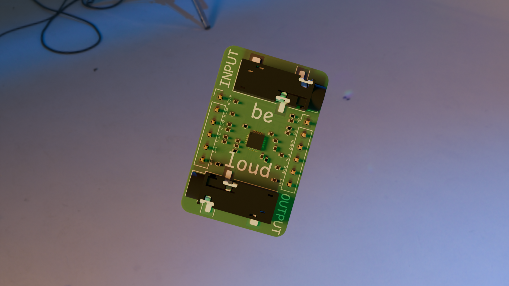
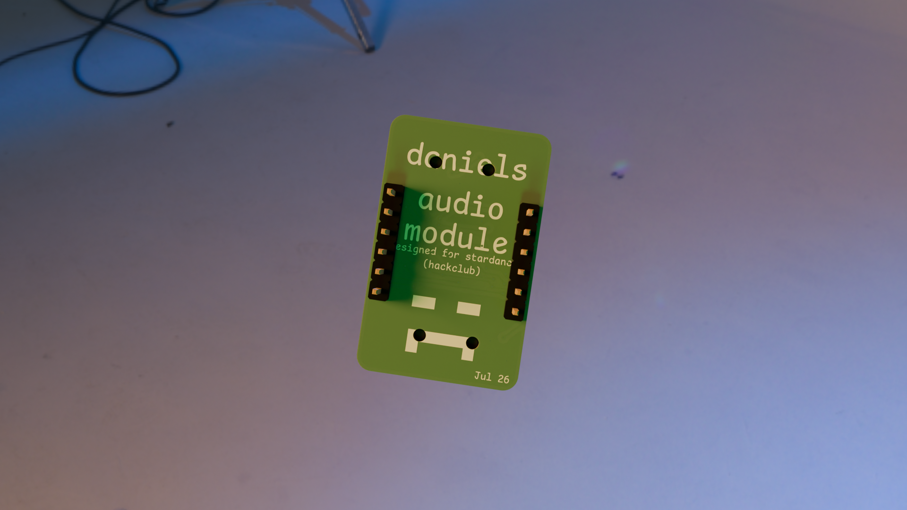
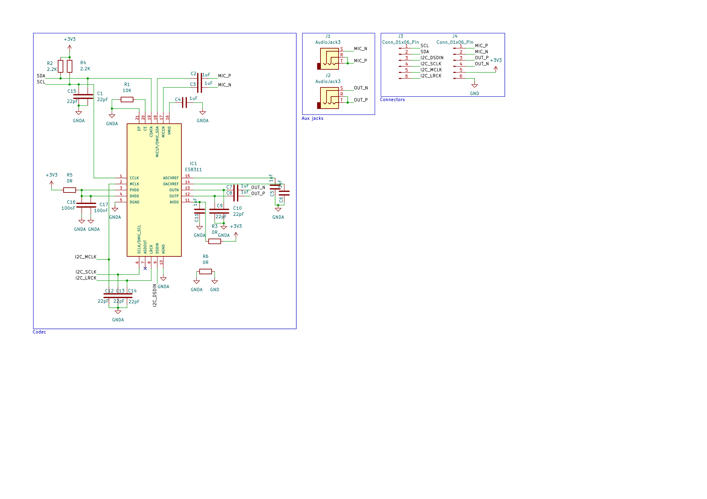
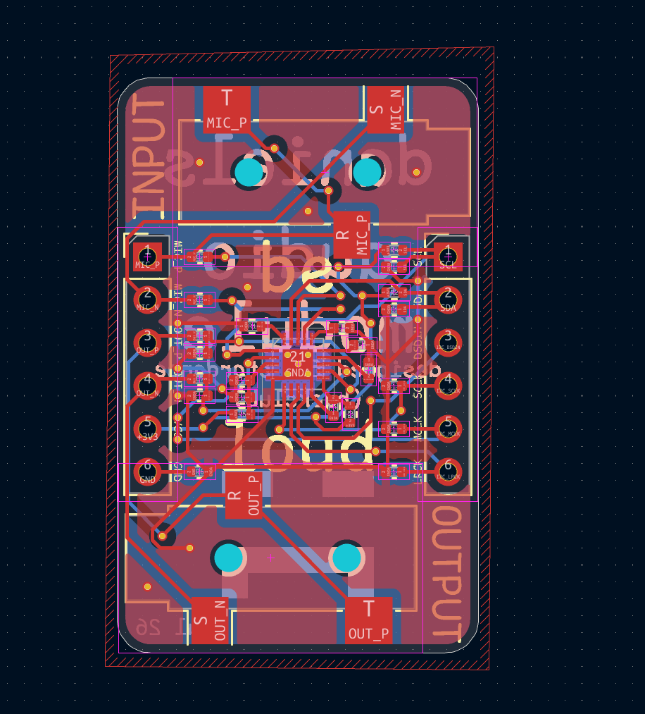
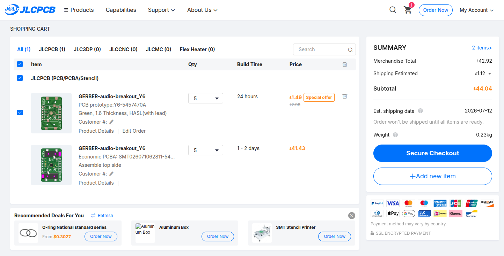

# Audio Codec Module (WIP)
I needed an audio codec module for an upcoming secret project and there was no other designs that fit my criteria so I made my own. It was made for hackclub (specifically stardance), if you want more info on this project; check the stardance journal for it [here.](https://stardance.hackclub.com/projects/20340)

### Front

### Back

## Features
- Mono audio input
- Mono audio output
- I2C comunication
- thats pretty much it :p

## What it is
It is a breakout board for the Everest Semiconductors ES8311 Audio codec IC. It is similar to the ES8388 but this one is mono instead of stereo. The design of the PCB is largely based upon the design done by WaveShare when they intergrated this chip into one of their [ESP32 dev boards](https://github.com/waveshareteam/ESP32-S3-Touch-LCD-1.83/blob/main/schematic/ESP32-S3-Touch-LCD-1.83-schematic.pdf)

### Schematic

### Pcb design

## BOM
You can find the BOM in the BOM.csv file. I have no idea if it is what is needed as it is what JLC needs for their assembly and what the JLC Kicad extension spits out. Lemme know if anything is wrong or needs changing.

## Note for reviewer
I have already uploaded it to JLC and got a price of ￡44.04 for assembly and shipping. That's around $60 for the PCB. So I am looking for a grant of $60.
